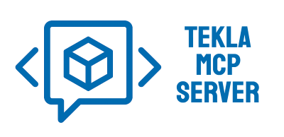

# Tekla-MCP-Server

This server facilitates interaction with Tekla Structures, helping users speed up modeling processes. It acts as a bridge between users and Tekla, enabling automated workflows and improving efficiency.

To use this server, users must first install and configure an MCP client.

Verified to work correctly with [chatmcp](https://github.com/daodao97/chatmcp) and [DeepChat](https://deepchat.thinkinai.xyz) clients.

### Features
- Insert/remove `Lifting Anchor (80)` Tekla component
- Insert custom components
- Selection of specified elements based on their type or Tekla class and name
- Selection of assemblies the specified elements belong to
- Showing of temporary names for selected elements in the model
- Converting cut parts into real parts

### Tools
The server provides the following tools:
- `put_wall_lifting_anchors`: Insert `Lifting Anchor (80)` Tekla components in the selected elements
- `remove_wall_lifting_anchors`: Remove `Lifting Anchor (80)` Tekla components from the selected elements
- `put_custom_detail_components`: Insert custom detail components with specified name to the selected elements
- `select_elements`: Select elements in Tekla model based on their type or Tekla class and name
- `select_elements_assemblies`: Get assemblies for the elements selected in Tekla model and select them
- `draw_elements_names`: Draw the temporary names for the selected elements in Tekla in the currently active rendered view
- `convert_cut_parts_to_real_parts`: Convert all cut parts in the selected elements into real model parts

## Requirements

Python 3.11, along with some libraries, is required. You can install all the necessary libraries by running:

    $ pip install -r requirements.txt

## Setting up

* Rename `config/settings.sample.json` to `config/settings.json` and adjust the values:

| **Property**         | **Default**                                        | **Description**                                                                 |
|-----------------------|----------------------------------------------------|---------------------------------------------------------------------------------|
| `tekla_path`          | "C:\\Program Files\\Tekla Structures\\2022.0\\bin" | The path to the directory where Tekla Structures is located                      |

* Rename `config/lifting_anchor_types.sample.json` to `config/lifting_anchor_types.json`, and specify the components for the lifting anchors used in your projects along with their attributes
* Rename `config/precast_element_types.sample.json` to `config/precast_element_types.json`, and set the values of Tekla classes used in your model
* Configure `tekla_mcp.py` as a custom MCP server in your MCP client

## Distribution

A standalone binary file can be created using [PyInstaller](https://pyinstaller.org) for easier distribution. To do this, install PyInstaller:

    $ pip install pyinstaller

Then, generate an executable with:

    $ pyinstaller tekla_mcp.py

This will produce a binary file inside the `dist/tekla_mcp/` directory, which can be distributed without requiring Python installation. Ensure the `_internals` directory is included alongside the binary. 

Additionally, when using this option, configuration files should be copied to the `_internals/config` directory.

## License

This software is open-source and released under the **GPLv3 license**. You are free to use, modify, and distribute it, as long as all modifications remain open-source under the same license.

For full details, please refer to the [LICENSE](LICENSE) file included in this repository.

## Disclaimer

This software is provided **as is**, without any warranties or guarantees of functionality, reliability, or security. The developer assumes **no responsibility** for any damages, data loss, or other issues arising from its use. 

Use at your own risk.
